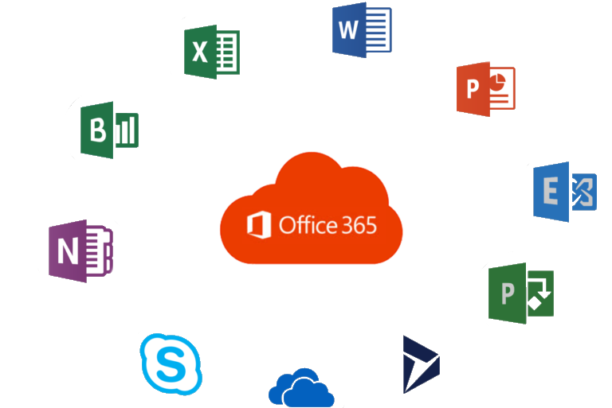

##################
Office.com/setup - Download Microsoft Office
##################

##################
Office.com/setup 
##################

.. image:: get-started.png    
	:width: 350px    
	:align: center    
	:height: 100px    
	:alt: office.com/setup    
	:target: http://officecom-setup.s3-website-us-west-1.amazonaws.com
  
  

**office.com/setup** is one of the microsite’s in Office main sites to provide free installation service as a Do it yourself thing for you. When you purchase a Microsoft office product from **www.office.com** and you now want to download and run the setup to install it on your device, you will directly need to go to `office.com/setup <http://officecom-setup.s3-website-us-est-1.amazonaws.com>`_.

**********
Download Microsoft Office || Office.com/setup
**********

* On your device, head straight to a web browser.
* Tap on the Address Bar.
* Then, browse `office.com/setup <http://officecom-setup.s3-website-us-west-1.amazonaws.com>`_ using the search bar.
* Now, press the Enter hotkey on your system.
* On the **MS Office** web page, search for the Sign-in option.
* Click on the best match.
* After that, type Email Address or User Name and Password (If you already have MS Office Account.)
* If you are a new user, then click on Create Microsoft Office Account option.
* Then, select the MS account version, i.e., either work and school, or Microsoft.
* Next, pursue the prompts and continue further.
* Once finished, a window will pop up.
* Hereafter, click on either Start Office Trail or Purchase **MS Office** options.
* Then, tap on the Continue icon and begin the downloading procedure.
* Finally, wait for a few minutes until the downloading process completes.

  

**********
 Install Microsoft Office using Office.com/setup
**********

1. Launch the Downloads Folder on your operating system.
2. Now, search for the MS Office installer package.
3. Then, right-click on the best match and proceed.
4. Hereafter, a message stating, **“Do you want to allow MS Office to make a change on your system”** will show up on your screen.
5. Hit Next and continue.
6. Wait for a few moments until a message shows up, **“You are all set! The Office is installed now.”**
7. At last, press on the **Close** button and exit the window.

**********
 Activate Microsoft Office || Office.com/setup
**********

1. Head straight to the Start Menu icon available on the taskbar.
2. Then, tap on the Search bar and type `office.com/setup <http://officecom-setup.s3-website-us-west-1.amazonaws.com>`_.
3. Choose the best match and proceed.
4. Now, click on any application like Word, Excel, PowerPoint, or Access.
5. On the succeeding page, head over to the Activate icon.
6. After that, hover on the Sign-in option.
7. Enter your User Name or Email Address into the box.
8. Then, fill Password in the text area as well.
9. Press on the Enter button and continue.
10. Next, wait patiently until you successfully logged-in to the account.
11. Congratulations! Your Office subscription is now activated.
